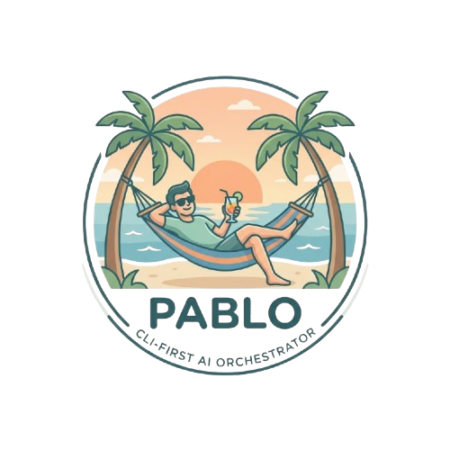

# P.A.B.L.O.



<i>Personal Assistant for Boring Logic & Operations</i>

PABLO is an AI orchestrator for the projects the user works on. It is not
a standalone CLI product: it plugs into an existing OpenCode/Orca agent
setup as a set of **OpenCode agents, commands, and skills**, backed by a
small PHP engine (Symfony Console) and an unattended background layer.

PABLO's philosophy: **agents are read-only and analysis-first**. PABLO
never writes or modifies code, never resolves conflicts, and never mutates
issue trackers (Jira / GitHub Issues / Linear stay strictly read-only). It
*does* perform git and PR-metadata operations — creating branches and
worktrees, rebasing, force-pushing (with lease only), creating draft PRs,
toggling PRs draft/ready, deleting worktrees — but only per the explicit
rules documented below, never on its own judgement.

## Quick start

Prerequisites: PHP 8.4.1+ + Composer, `gh` (+ `gh auth login`), the Orca
and opencode apps, the Atlassian CLI `acli` (`acli auth login`). Full details and
platform-specific steps: [docs/installation.md](docs/installation.md).

```bash
./bin/install.sh    # composer install, writes the pablo shim + agent/command links,
                     # starts the background scheduler, finishes with `pablo system:doctor`
./bin/install.sh --with-web  # ...also keeps the dashboard running as a background service
pablo system:doctor        # verify everything's installed and authenticated
```

Add a project with the interactive wizard (`pablo project:new`) or by dropping a
YAML file in `~/.pablo/projects/` (copy the template
`docs/examples/acme-pim.yaml`, or see the full schema in
[docs/configuration.md](docs/configuration.md)).

Then, day to day:

```
pablo task:start https://acme.atlassian.net/browse/XXX-123          # start a task from an issue
pablo task:start --project wallet-kit "fix callback verification"   # ...or from a prompt
pablo task:list             # see all active tasks and their state
/pablo-commit-and-pr         # commit, push, open a draft PR
pablo task:waiting           # pause/resume a task
pablo task:close             # abandon/clean up a task (escape hatch)
```

Or, for the same picture in a browser:

```bash
pablo web           # read-only dashboard on http://127.0.0.1:8321
                    # ...or ./bin/install.sh --with-web to run it as a background service
```

Two task tables (what needs you, and everything else), a live poller
countdown, the paste-ready Slack messages, and the last rebase log —
see [docs/dashboard.md](docs/dashboard.md).

PABLO takes it from there in the background — running review/CI/testing
agents and advancing the task's state automatically. See
[docs/state-machine.md](docs/state-machine.md) for the full flow and
[docs/agents-commands.md](docs/agents-commands.md) for every command.

## Backups and restore

Everything PABLO knows about your tasks lives in one place — `~/.pablo/`
(state store, poller stamps, rebase logs, cache). Move or reinstall PABLO and
pick up exactly where you left off:

```bash
pablo archive:backup                    # write ~/.pablo-backups/pablo-backup-<ts>.tar.gz
pablo archive:backup /path/to/backup.gz # choose the destination
pablo archive:restore /path/to/backup.gz
```

A backup bundles all state under `~/.pablo/` **except agent sessions
(`agents/`, the opencode sessions) and transient worktree checkouts**. It
also embeds your `~/.pablo/projects/*.yaml` configs, a manifest of every task
worktree (project, origin URL, branch), and a best-effort snapshot of
Orca-registered repos.

Restore is interactive: it re-materialises the state store and configs, then
— one repository at a time — asks where to create each checkout (cloning from
the recorded origin if needed) and recreates every task worktree from its
remote branch, rewriting each task record's `worktree_path`. After worktrees
are restored, each project's repository is re-registered with Orca via `orca
repo add` so that agent launching works on the new host (best-effort: warns if
Orca isn't running). Branches with local-only (unpushed) commits are skipped
with a warning. Use `pablo archive:restore <archive> --skip-worktrees` to
restore state without touching the worktrees, `--skip-orca` to skip Orca repo
registration, and `--yes` to answer every overwrite prompt non-interactively.
Tracker credentials / auth are not migrated — run `pablo system:doctor` on the new
host.

## Example workflow

A task's life from issue to merge, alternating what you do and what
PABLO does in the background:

1. `pablo task:start https://acme.atlassian.net/browse/XXX-123` — the task
   starts: worktree and branch created, a **task-analyst** agent launches.
2. `pablo task:list` — check that it's running.
3. The task-analyst agent finishes. Open it in Orca and read its plan.
4. Chat with the agent in that session to fine-tune the plan.
5. `/pablo-commit-and-pr` — commits, pushes, opens the PR as **draft**.
6. CI runs... and turns red.
7. PABLO notices and launches a **ci-analyst** agent to dig into the
   failure.
8. Read its output, chat with it to work out the fix, then
   `/pablo-commit-and-pr` again — the PR goes back to `draft` while CI
   reruns.
9. CI turns green 🎉 — PABLO takes the PR out of draft
   (`ready-to-review`).
10. A coworker reviews your changes and approves.
11. PABLO detects the approval and moves the task to `needs-testing` —
    waiting on QA.
12. QA tests it and signs off.
13. The PR is merged. PABLO detects the merge, deletes the task's state,
    and removes the worktree.

## Layout

```
pablo/
├── README.md                  ← you are here (short overview)
├── docs/                      ← one file per subject, source of truth for details
├── app/                       ← the Symfony application (composer package `pablo`)
│   ├── bin/pablo              ← the `pablo` CLI (PABLO subcommands only)
│   ├── bin/console            ← framework maintenance CLI (cache:clear, lint:twig, …)
│   ├── public/index.php       ← dashboard front controller (`pablo web`)
│   ├── config/                ← bundles.php, services.php, routes.php, packages/
│   ├── src/                   ← the engine (see "Engine modules")
│   ├── templates/             ← Twig: base + dashboard page + UX components
│   ├── assets/                ← app.js, styles, Stimulus controllers, vendored JS, icons
│   ├── importmap.php          ← AssetMapper importmap (Bulma, Stimulus, LiveComponent)
│   ├── tests/                 ← PHPUnit suite
│   ├── composer.json / phpunit.xml / phpstan.neon / .php-cs-fixer.php
├── castor.php                 ← QA tasks (cs-fixer, phpstan, test) via castor-php/php-qa
├── castor.composer.json       ← remote castor package (castor-php/php-qa)
├── bin/install.sh             ← composer install, shim, agent/command/unit links
├── bin/uninstall.sh           ← reverse of install.sh (keeps ~/.pablo data)
├── systemd/                   ← pablo-dispatch.service + .timer (user units)
└── opencode/
    ├── agents/                ← task-analyst.md, task-feedback.md, ...
    └── commands/              ← pablo-commit-and-pr.md
```

Real project configs live per-user under `~/.pablo/projects/` (one YAML per
managed project); the repo only ships the neutral example in
`docs/examples/acme-pim.yaml`.

Everything PABLO creates lives inside this repository. The originals in
`~/.config/opencode/{agents,commands}/` are never modified — `install.sh`
only creates **new symlinks** pointing into this repo (and refuses to
overwrite anything that isn't already such a symlink). Runtime data lives
in `~/.pablo/` (see [docs/state-machine.md](docs/state-machine.md#task-state-storage)).

### Engine modules (`app/src/`)

Namespaces mirror folders (`Pablo\ => src/`).

| file | responsibility |
|---|---|
| `bin/pablo`, `bin/console` | the `pablo` CLI (`pablo.command` tag only) and the framework maintenance CLI |
| `App/Kernel.php`, `App/ConsoleApplication.php` | the single FrameworkBundle kernel (CLI + web) + command registration |
| `Controller/` | the dashboard route (`GET /`) |
| `Dashboard/` | dashboard data: task board, poll countdown, sync-log view |
| `Twig/Components/` | Twig/Live components rendering the dashboard |
| `Command/*.php` | one Symfony Console command per subcommand (grouped by topic) |
| `Config/` | project YAML loading + per-key defaults merge (`Config`, `ProjectConfig`) |
| `Domain/` | `Task`/`Issue` records, `State` + `Agent` enums, `Time`, `DisplayCache`/`AgentLaunch` VOs |
| `StateMachine/` | the data-driven state machine (single on-enter handler) |
| `Store/` | central state store + per-task flock |
| `Poller/` | the per-project state-polling job + merge auto-close |
| `Provider/Gh/` | GitHub PR plumbing: CI evaluation, review evaluation, draft/ready |
| `Provider/Git/` | git worktrees, lease-safe sync, per-project sync job |
| `Provider/Confluence/` | Confluence page fetch via the `acli` CLI |
| `Provider/Tracker/` | one class per issue tracker + `ProviderInterface`/registry |
| `Agents/` | launching OpenCode agents via Orca, activity queries |
| `Listing/` | the `pablo task:list` terminal tables |
| `Domain/PrBadge`, `Domain/AgentActivity` | PR/agent state as structure, shared by the terminal and web renderers |
| `Doctor/` | CLI preflight checks (`pablo system:doctor`) |
| `Dispatch/` | the cron dispatcher fired by the systemd timer |
| `Support/` | `PabloError`, `Proc` (shell helper), `Naming`, `RepoSlug` |

## Documentation

Each subject has its own file under `docs/` — read the relevant one
before making non-trivial changes in that area:

- [docs/installation.md](docs/installation.md) — install script, per-platform
  dispatcher, macOS smoke checklist, Orca visibility
- [docs/agents-commands.md](docs/agents-commands.md) — the agents, the
  OpenCode command, skills
- [docs/state-machine.md](docs/state-machine.md) — starting a task, every
  state and transition, task storage format
- [docs/background-layer.md](docs/background-layer.md) — the two layers,
  worktree sync, closing a task, agent execution via Orca
- [docs/providers.md](docs/providers.md) — GitHub/Jira/Linear/Confluence
  access via `acli`/`gh`/`linear`, `pablo system:doctor` preflight
- [docs/configuration.md](docs/configuration.md) — project YAML schema,
  branch naming convention
- [docs/listings.md](docs/listings.md) — terminal table layout for
  `pablo task:list` and `pablo project:list` output
- [docs/dashboard.md](docs/dashboard.md) — the `pablo web` dashboard: what
  it shows, what it guarantees, how its assets are vendored

## Development

The QA tooling runs through **Castor** (global binary) + the remote
`castor-php/php-qa` package; the PHP tools are downloaded on demand, never
installed locally.

```bash
castor install                          # everything: app deps, tools, shim, agents, scheduler
castor qa:test                          # PHPUnit suite (in app/)
castor qa:phpstan                       # static analysis, level 8 (app/src)
castor qa:phpstan --generate-baseline   # (re)generate phpstan-baseline.neon
castor qa:cs-fixer                      # php-cs-fixer with @Symfony + @Symfony:risky
castor qa:twig-cs-fixer                 # lint/fix app/templates
cd app && composer test                 # same as castor qa:test
pablo --help                          # engine subcommands
pablo web                             # the read-only dashboard on 127.0.0.1:8321
php app/bin/console cache:clear       # framework maintenance CLI (also lint:twig, debug:router)
journalctl --user -u pablo-dispatch.service -f   # background layer logs
```

Composer/analysis caches land under `app/var/cache/` (gitignored). PHPStan is
configured at **level 8**; raise it further by fixing the errors it reports,
never by ignoring them. The tests mirror the `app/src` layout under
`app/tests/` (e.g. `app/src/Config/Config.php` → `app/tests/Config/ConfigTest.php`).
