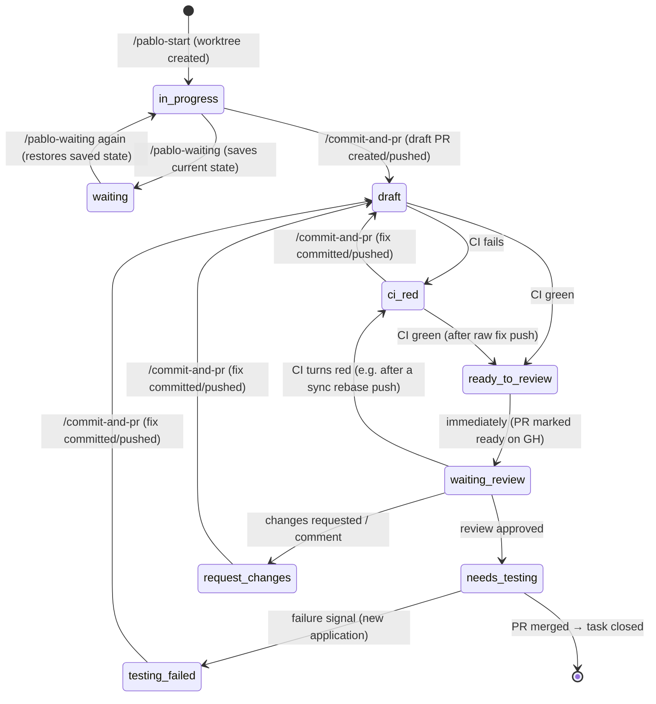

# PABLO — AI Orchestrator Prompt

This repo is **PABLO**, an AI orchestrator for the projects I work on.

PABLO is not a standalone CLI. It's a set of **OpenCode agents,
commands, and skills** meant to plug into my existing OpenCode setup, the
same way as my other agents (`jira-analyst`, `jira-feedback`,
`pr-review-planner`, `heavy-plan`, `commit-and-pr`,
`github-awaiting-review`, `github-milestone-triage`). It follows this
philosophy: **agents are read-only and analysis-first** — they analyze and
plan, never write code. PABLO itself never writes or modifies code, never
resolves conflicts, and never mutates issue trackers (Jira/Linear/GitHub
issues stay strictly read-only). It *does* perform git and PR-metadata
operations — creating branches/worktrees, rebasing and force-pushing (with
lease), creating draft PRs, toggling PRs draft/ready, deleting worktrees —
but only per the explicit rules laid out in this document, never on its
own judgement.

Concretely, this means:

- **Skills** hold the shared logic/knowledge (e.g. how to read a project's
  YAML config, how to talk to each issue-tracker provider, how to enumerate
  worktrees). Skills are invoked by agents/commands, not called directly by
  me.
- **Agents** are the higher-level, model-driven flows (e.g. an agent that
  reviews worktree sync status across all projects and reports what it
  finds).
- **Commands** are the explicit, scriptable entry points I invoke directly
  (e.g. `/pablo-sync`, `/pablo-issues`), each mapped to one clear action.

Document the agent/command/skill breakdown, naming, and folder layout in
`@README.md`, matching the conventions already used in my other OpenCode
agents.

Everything else that needs to be documented should live in `@README.md`.
Keep it up to date as the structure evolves — it's the source of truth, not
this prompt.

## Local paths

- **OpenCode agents folder**: `~/.config/opencode/agents/` (i.e.
  `/home/baptiste/.config/opencode/agents/` on this machine). Whenever
  this prompt references an existing agent by name (`jira-analyst`,
  `jira-feedback`, `pr-review-planner`, etc.), it lives there. Whatever
  implements this prompt should read the actual file at that path to get
  the agent's real content — this prompt can't read local files itself, so
  don't guess at what an agent does; check the folder.
- **OpenCode commands folder**: `~/.config/opencode/commands/`. Same deal
  — when this prompt references an existing command by name (e.g.
  `commit-and-pr`), read its actual content from there rather than
  guessing what it does.
- **Naming note**: `jira-analyst` and `jira-feedback` are the *source*
  agents on disk today (Jira-only). PABLO generalizes each of them into
  its own new agent — `task-analyst` and `task-feedback` respectively —
  that handles Jira, GitHub Issues, and Linear. Everywhere else in this
  document, `task-analyst`/`task-feedback` refers to the generalized
  version PABLO creates and manages; `jira-analyst`/`jira-feedback` refers
  only to the original source file used as its basis.
- **All referenced agents/commands are basis material, not final
  behavior.** Every existing agent or command this spec names —
  `jira-analyst`, `jira-feedback`, `pr-review-planner`, `commit-and-pr`,
  and any other — is an **example/starting point**: read its actual
  content, then rework it into PABLO's own version as much as needed to
  fulfill what this spec requires. Never assume the existing version does
  the job as-is (e.g. the existing `commit-and-pr` knows nothing about
  PABLO states; PABLO's `/commit-and-pr` is a new command built from it
  plus the state logic).
- **Everything PABLO creates lives inside the PABLO repository.** All
  agents, commands, skills, and scripts built for PABLO are created
  **within the PABLO repo** — no files outside the repository are ever
  modified. The originals in `~/.config/opencode/agents/` and
  `~/.config/opencode/commands/` stay untouched; if something from
  outside the repository is needed as a basis, **copy it into the PABLO
  repo** and rework the copy. (Runtime data PABLO owns — the central
  state store, worktrees under the default `worktrees_root` — and the git
  operations this spec explicitly defines on managed project repos are
  the only things PABLO touches outside its own repository.)

## Implementation architecture

PABLO is split into two layers, because part of what it does only makes
sense running inside an interactive OpenCode session, and part of it has
to run unattended on a schedule with no session open.

**Interactive layer — OpenCode agents/skills/commands.** Everything I
invoke myself: `/pablo-start`, the task tracking agent, the task listing,
`/pablo-close`, `/pablo-waiting`, `/pablo-state` (manual override), and
`/commit-and-pr` (PABLO's own version, built from my existing
`commit-and-pr` command — see "Local paths"). This is the
layer described throughout the rest of this document.

**Background layer — a small unattended component, driven by cron/systemd
timers.** This handles anything that must run without me present:

- per-project worktree sync (`sync.interval_minutes`)
- per-project task-state polling — CI/PR/review/testing-signal checks for
  the post-draft state transitions (`ci-red` → ... →
  `needs-testing`/`request-changes`/`testing-failed`) — on its own cron,
  driven by `state_polling.interval_minutes`
- writing/updating task state, in a central store owned by PABLO's own
  installation (not inside any project repo — see "Task state" for why)

This layer is mostly plain logic — git commands, GitHub/Jira/Linear API
calls, file I/O — and doesn't need its own LLM invocation for most of it.
When it does need to trigger actual agent work (e.g. running `task-analyst`
automatically when a task enters `in-progress`, or `task-feedback` on
`testing-failed`, or `pr-review-planner` on `request-changes`), **it
should do so via Orca CLI commands** rather than building a separate
invocation mechanism, reusing the same agent-runner path already used
across my other Orca-managed agents. Document the exact Orca CLI
invocation (command name, flags, how the target worktree/agent is passed
in) in `@README.md` once settled.

**Code quality expectations.** All generated code (bash scripts, state
machine, pollers, commands) should be **robust, clean, and extensible**:

- The state machine must be **data-driven**: states, their on-enter
  actions, and their transitions declared in one central place (a table /
  config structure), so adding or removing a state touches that one place
  plus its handler — not a hunt through scattered `if` branches across
  pollers and commands.
- Fail loudly and cleanly: clear error messages, non-zero exit codes,
  never half-applied operations (the per-task lock exists for this — use
  it consistently).
- Keep provider-specific logic (gh/jira/Linear CLI calls) isolated behind
  a small per-provider interface so adding a fourth provider later is
  additive, not surgery.

**Considered and rejected: OpenClaw.** OpenClaw's built-in scheduled
"heartbeat" polling would map naturally onto the background layer's needs.
It was ruled out for this project because: it's a much heavier piece of
infrastructure than needed here (a persistent self-hosted gateway process
with messaging-channel integrations, versus a cron job calling a few
APIs); its skill/plugin system runs with full operator-level privilege and
no sandbox boundary between a loaded skill and shell/file-system execution;
and skills pulled from its community registry have no cryptographic
integrity verification, which is a documented supply-chain risk. Given
PABLO's background layer already needs shell and API access, adding an
unsandboxed, unverified skill-loading surface on top wasn't worth it,
especially stacked on an already-working OpenCode/Orca agent ecosystem.
Keep this note in `@README.md` so the reasoning isn't re-litigated later
without cause.

**Provider access: CLI-first, no tokens in PABLO.** Everywhere PABLO
needs to talk to an external service, it uses that service's CLI rather
than an MCP server or raw API calls with stored tokens:

- **GitHub**: the `gh` CLI — task tracking (issues, linked PRs),
  post-draft state polling (CI status, PR review state, marking a PR
  ready/draft), everything. Document the specific subcommands/flags used
  per feature (e.g. `gh pr checks`, `gh pr view --json reviews`) in
  `@README.md` as they're implemented.
- **Jira**: the `jira` CLI, same principle.
- **Linear**: the corresponding Linear CLI — pick one, and document which
  in `@README.md`.

This applies to both layers: the background component shells out to these
CLIs for its polling, and any interactive agent/command doing
provider-related work does the same instead of reaching for an MCP tool.
Because each CLI manages its own authentication (its own login/config),
**PABLO stores no tokens at all** — there is no secrets section in the
project config, and none should be added. If a CLI isn't authenticated,
surface that CLI's own error/instructions rather than inventing a token
mechanism.

**CLI preflight check script.** PABLO includes a **bash script** (e.g.
`bin/check-clis.sh`, also exposed as something like `/pablo-doctor`) that
verifies all required CLIs are ready before anything relies on them:

- First, determine which CLIs are actually **required by the configured
  projects**: scan `projects/*.yaml` (skipping `default.yaml`) and collect
  the set of `issue_tracker.provider` values in use. `gh` is always
  required (every project's PR/CI flow goes through GitHub); `jira` only
  if at least one project uses the `jira` provider; the Linear CLI only if
  at least one uses `linear`. Don't check CLIs no project needs.
- For each required CLI, check both that it's **installed** (on `PATH`)
  and **authenticated** (e.g. `gh auth status`, the `jira` CLI's
  equivalent, etc. — use each CLI's own status/whoami command).
- Output a clear per-CLI pass/fail summary, with the CLI's own login
  instructions on failure, and exit non-zero if anything required is
  missing — so the script is usable both by me interactively and as a
  guard at the start of the background jobs (a cron run that's missing an
  authenticated CLI should fail fast with a clear message, not half-run).

## Project types

PABLO manages three types of projects:

- `work`
- `open-source`
- `personal`

Each managed project has a configuration file under `projects/` using the
YAML structure below. Document this structure in `@README.md`, including
every field and its accepted values.

```yaml
name: wallet-kit
type: open-source          # work | open-source | personal
repo:
  path: ~/dev/wallet-kit
  primary_branch: main
worktrees_root: ~/dev/wallet-kit-worktrees   # optional; defaults to ~/.pablo/worktrees/[repository_name]/
issue_tracker:
  provider: github          # github | jira | linear
  identity: bfontaine       # username/account used to filter "assigned to me"
  project_key: WK           # required for jira/linear; for github, used as the branch prefix since GitHub has no native project key
sync:
  strategy: rebase          # rebase | merge
  auto_apply: false         # if false, sync runs as a dry-run and reports only
  interval_minutes: 30      # how often the cron-driven sync runs for this project
state_polling:
  interval_minutes: 10      # how often the cron-driven task-state polling (CI, PR, review, testing signals) runs for this project
testing:
  failure_signal: qa-failed   # GitHub: a label name PABLO watches for on the PR/issue.
                               # Jira/Linear: a status value PABLO watches for on the linked issue.
                               # Which meaning applies depends on issue_tracker.provider.
review:
  bot_whitelist: []            # bot accounts whose PR reviews should be taken into account
                               # despite being bots (e.g. ["copilot-pull-request-reviewer[bot]"]).
                               # All other bot reviews are ignored by the review evaluation.
```

Feel free to extend this schema if a feature needs it, but keep it
consistent across project types and document any addition in `@README.md`.
Note: `projects/default.yaml` (see "Configuration defaults" below) lives
in this same folder but is **not** a project — when PABLO scans
`projects/` for project configs, it must explicitly skip that filename
rather than trying to treat it as one.

## Configuration defaults

Some config keys (currently `sync.strategy`, `sync.auto_apply`,
`sync.interval_minutes`, `state_polling.interval_minutes`,
`review.bot_whitelist`) support a
PABLO-wide default so I don't have to repeat the same value in every
project's YAML. PABLO ships its own defaults file (e.g.
`projects/default.yaml` — same folder as the per-project config files)
holding a value for each of these keys:

```yaml
sync:
  strategy: rebase
  auto_apply: false
  interval_minutes: 30
state_polling:
  interval_minutes: 10
review:
  bot_whitelist: []
```

- If a project's config sets one of these keys, that value wins.
- If a project's config omits it, PABLO falls back to the value in
  `projects/default.yaml`.
- This is a per-key merge, not "all or nothing" — a project can override
  just `sync.interval_minutes` while leaving `sync.strategy` and
  everything else on the default.

New config keys added later should follow the same pattern (a default in
`projects/default.yaml`, overridable per-project) unless there's a good
reason a key must always be explicit per-project (e.g. `issue_tracker`,
which has no sensible global default). Document the full list of
default-eligible keys in `@README.md` and keep it in sync as the schema
grows.

## Branch naming convention

Branches created or matched by PABLO always follow the fixed pattern:

```
[project-key]-[issue-id]
```

lowercased, e.g. `xxx-123` for Jira issue `XXX-123`.

- **Jira / Linear**: `project-key` is the issue's own project key (e.g.
  `XXX`), lowercased. `issue-id` is the numeric/short ID from the issue key
  (e.g. `123` from `XXX-123`).
- **GitHub**: since GitHub has no native project key, use the project's
  `issue_tracker.project_key` config value as the prefix, and the issue
  number as `issue-id` (e.g. `project_key: WK` + issue #45 → `wk-45`).
- No slug or title text is appended — the branch name is just the two
  parts above.
- **Duplicates**: if a branch matching `[project-key]-[issue-id]` already
  exists (e.g. `xxx-123`), don't reuse or overwrite it. Append `-2`, `-3`,
  etc. — trying each in order — until an unused branch name is found (e.g.
  `xxx-123-2`, then `xxx-123-3`). This applies both when creating a new
  worktree and any other place PABLO generates a branch name for a task.

Document this convention verbatim in `@README.md` so it's easy to reference
without digging through the codebase.

## Worktree sync

For every managed project, PABLO checks all active worktrees and keeps them
up-to-date with the project's `primary_branch`.

- Discover worktrees via `git worktree list` against `repo.path`, plus
  anything found under `worktrees_root` if set.
- Sync strategy (`rebase` or `merge`) is per-project, read from the config.
- Sync runs on a **per-project cron schedule**, driven by
  `sync.interval_minutes` in that project's config. Each project can have
  its own interval; there's no single global schedule. Document in
  `@README.md` how the cron jobs get installed/registered (e.g. one
  system-level timer that reads all project configs and dispatches, vs one
  timer per project) — pick whichever is simpler to manage and keep in sync
  when projects are added/removed.
- Default behavior is a **dry run**: report which worktrees are behind and
  what a sync would do, without changing anything.
- Only perform the actual sync when `sync.auto_apply: true` is set, or when
  I explicitly invoke the sync command with an `--apply` flag. The
  cron-triggered run should respect `auto_apply` from the config — it does
  not imply `--apply` on its own.
- Sync applies to **all task worktrees regardless of PABLO state**,
  including post-draft ones with open PRs. **Before rebasing/merging onto
  `primary_branch`, always fetch and integrate the worktree's own remote
  branch first** — if someone else pushed commits to the same branch,
  those are pulled in before the rebase, so sync never clobbers a
  collaborator's work and the subsequent lease check doesn't fail on their
  push. When a rebase rewrites history
  on a branch that has a remote/PR, push it with **`--force-with-lease`**
  — never plain `--force`. If the lease check fails (the remote moved
  under us, e.g. I pushed something mid-sync), abort that worktree's sync
  cleanly and retry on the next cron cycle rather than overwriting.
- **Coordination with the state poller.** The sync job and the state
  poller must never interleave on the same task. Each task record in the
  central store supports a short-lived **per-task lock** (holder +
  timestamp, with a staleness timeout so a crashed process can't wedge a
  task forever). Both acquire this lock before touching a task's branch or
  state, and release it when done. Note that there is **no git-push
  detection anywhere in the state machine** — the
  `request-changes`/`testing-failed` → `draft` transitions are triggered
  by `/commit-and-pr`, not by observing pushes — so sync's own
  force-pushes need no special masking or SHA tracking; the lock is the
  only coordination required.
- **Never auto-resolve merge/rebase conflicts.** If a conflict occurs, stop,
  leave the worktree as-is, and report:
  - which worktree/branch
  - which files are in conflict
  - a summary of the conflicting hunks
  Do not commit a resolution on my behalf under any circumstance. If I later
  want auto-resolution for trivial, low-risk cases (e.g. lockfiles), that
  will be an explicit per-project opt-in, not a default behavior.

## Task tracking agent

PABLO includes an agent that lists issues assigned to me for a given
project. It must support GitHub, Jira, and Linear, selected via
`issue_tracker.provider` in the project config.

- Use `issue_tracker.identity` (and `project_key` where relevant) to filter
  "assigned to me" — don't assume a single global identity works across all
  three providers.
- No tokens are stored anywhere: all provider access goes through each
  provider's CLI (`gh`, `jira`, Linear CLI — see "Provider access" in the
  implementation architecture), which handles its own authentication.
- Output is a **terminal table**. For each issue, show:
  - Issue key/ID and title (Jira, Linear, or GitHub issue)
  - Status (e.g. To Do / In Progress / Done, normalized across providers as
    best as possible)
  - Related GitHub PR, if one exists and can be linked (e.g. via branch
    naming convention, PR description referencing the issue key, or linked
    issue metadata) — show PR number/title and its state (open/draft/merged)
  - Local git branch, if one exists for that issue in the project's repo or
    worktrees — match using the `[project-key]-[issue-id]` convention
    (see "Branch naming convention" above), including any `-2`, `-3`, etc.
    suffix variants.
  - Leave the cell blank/dash when no matching PR or branch is found rather
    than guessing.
- This agent is read-only: it lists and summarizes issues, it does not
  create, close, or modify anything.

## Starting a new task

PABLO includes a command to start work on a task by creating a new worktree
for the target project. It supports two entry points:

**1. From an issue link**

- Input: a URL to a Jira, Linear, or GitHub issue.
- PABLO identifies which managed project the link belongs to by matching
  the URL against each project's `issue_tracker` config (provider +
  project_key, or repo for GitHub issues). If no project matches, stop and
  report — don't guess.
- Fetch the issue's key from the provider — it's what the branch name is
  built from (see "Branch naming convention").
- Create a new worktree under the project's `worktrees_root` (defaulting
  to `~/.pablo/worktrees/[repository_name]/` when the key isn't set),
  branched off `primary_branch`, using the branch name
  generated per the "Branch naming convention" above (e.g. `xxx-123`).
- If that branch name is already taken by an existing worktree/branch for
  the *same* issue, reuse it rather than creating a duplicate — report the
  existing one (or ask me if that's ambiguous). If it's taken by something
  unrelated, fall back to the `-2`, `-3`, ... suffix rule.

**2. From a plain prompt, no issue**

- Input: a short free-text description of the task (no issue link).
- I still need to specify which project this belongs to, since it can't be
  inferred from a link. If not given explicitly, ask which project.
- There's no issue key/ID to build `[project-key]-[issue-id]` from. Use the
  project's `project_key` plus a short slug derived from the prompt instead
  (e.g. `xxx-fix-callback-verification`), and apply the same `-2`, `-3`,
  ... duplicate-handling rule if that name is already taken.
- Create the worktree the same way as the issue-linked flow, just without
  any issue metadata attached.

In both cases, this command only creates the worktree/branch itself — it
does not open an editor or make any code changes on its own. Document the
exact command name and flags (e.g. `/pablo-start <link>` vs `/pablo-start
--project=wallet-kit "fix callback verification"`) in `@README.md`. Once
created, the task's state is set to `in-progress` (see "Task state"
below), and PABLO automatically runs the `task-analyst` agent (see "Local
paths") against the new worktree as part of that transition.

## Task state

Each task tracked by PABLO (i.e. each worktree created via the "Starting a
new task" command) has exactly one state at a time:

- `in-progress` — the starting state, set automatically as soon as the
  worktree is created. PABLO automatically runs the `task-analyst` agent
  (see "Local paths") against the worktree at this point — **once per
  task**: the central store keeps a `task_analyst_ran` flag per task, set
  after the first run, and the `in-progress` on-enter action skips the
  agent when the flag is already set (so coming back to `in-progress`
  later, e.g. from `waiting`, doesn't re-run it). The task listing
  agent-running column (see "Task listing") tells me when that run has
  finished, so I know when it's safe to go in and start working myself.
- `waiting` — I'm blocked waiting on feedback from the issue
  reporter/reviewer. No automatic trigger; entered and exited via the
  `/pablo-waiting` command (run from inside the worktree — same cwd
  convention as `/pablo-state` and `/pablo-close`), which is a **toggle**:
  - First call: the current state is **saved** in the central store
    (`state_before_waiting`), then the task switches to `waiting`.
  - Second call (while in `waiting`): the task is **restored to the saved
    state**, running that state's normal on-enter actions (via the shared
    on-enter handler) unless they've already run (e.g. `task-analyst`'s
    run-once flag still applies).
  - **Forbidden from `request-changes` and `testing-failed`**: the toggle
    refuses to run from those two states (with a clear error message) —
    it is impossible to go from `request-changes` or `testing-failed` to
    `waiting`. The same restriction applies when forcing `waiting` via
    the generic `/pablo-state waiting`, which otherwise uses the same
    on-enter handler and also saves the previous state.
  - **While a task is in `waiting`, the state poller skips it — with one
    exception: merge detection still runs.** No CI/review/testing-signal
    transitions are evaluated, but a merged PR is a status we need to
    know about even while paused, so the merge check keeps running and
    triggers the normal auto-close flow (see "Closing a task") if the PR
    gets merged. Worktree sync also still runs (the branch is kept up to
    date with `primary_branch`, nothing more). All other events during
    the pause (an approval, a failure-signal label) aren't lost, just
    deferred: they're picked up by the first poll after un-pausing, since
    the review/signal filtering is timestamp-based.
  This makes `waiting` safe to use from post-draft states like
  `waiting-review`: pausing and un-pausing returns the task to the state
  (and polling scope) it was in.
- `draft` — I've finished (a round of) my work and sent it to GitHub.
  Entered by running `/commit-and-pr` (based on my existing
  `commit-and-pr` command — see "Local paths"): it makes the commit,
  pushes the branch, and creates the PR **as a draft PR on GitHub** if one
  doesn't already exist (if a PR already exists, it just commits and
  pushes). **If there are no local git changes to commit, the command
  stops early with a clear message and does nothing** — no push, no PR
  creation, no state change. A **`--force` flag** overrides that early
  exit: the commit step is skipped (nothing to commit), but the rest of
  the flow runs as usual — pushing any existing unpushed commits,
  creating the draft PR if missing, and switching the state — for the
  case where I already committed manually and just want PABLO to take it
  from there. Once the push/PR-creation succeeds, **the
  command itself
  switches the PABLO state to `draft`** (via the shared on-enter handler
  — see "Manually forcing a state") as its final step. No polling is
  involved in this transition. `/commit-and-pr` is valid from exactly
  these states: **`in-progress`, `ci-red`, `request-changes`, and
  `testing-failed`** — it is the single, uniform way work re-enters
  `draft` from all of them. There is **no git-push detection** anywhere
  in the state machine: a raw `git push` without the command does not
  change PABLO state. If run from a directory that isn't a PABLO task
  worktree, `/commit-and-pr` refuses with a clear message — the untouched
  original `commit-and-pr` command still exists for non-PABLO work (see
  the repository-containment rule in "Local paths").
- `ci-red` — the PR's CI is failing; work is needed to fix it.
- `ready-to-review` — CI is green and the PR has just been marked ready
  for review.
- `waiting-review` — the PR is ready and is now actively waiting on a
  reviewer to look at it.
- `needs-testing` — a reviewer approved the PR; it still needs manual
  testing on my end before merge.
- `request-changes` — a reviewer left comments or requested changes; I
  need to go address them.
- `testing-failed` — manual testing (from `needs-testing`) turned up a
  problem; work is needed to fix it. See "Post-draft state transitions"
  for how this triggers and what runs automatically.

When testing from `needs-testing` succeeds, there's no further automatic
state — the task is closed via `/pablo-close` (see "Closing a task"),
either manually or automatically once the PR is merged on GitHub. This is
what resolves the "what happens after needs-testing" question rather than
inventing a `merged`/`done` state.

There's no separate `todo` state: an issue assigned to me but not yet
started simply has no task/worktree, so it doesn't appear in this state
model at all — it only shows up as an assigned issue in the task tracking
agent's output (see below), with no worktree/PR/state columns filled in.

There's also no separate `init` state: task creation and the first
automatic agent run both happen as part of entering `in-progress`
directly, rather than as a separate step.

State is stored centrally, within PABLO's own installation (not inside any
project repo or worktree, to avoid polluting my projects with PABLO-owned
files) — a central store keyed by project + branch name. Document the
storage format and location in `@README.md`.

**The `in-progress` auto-run agent.** On task creation, PABLO
automatically runs `task-analyst` against the new worktree — the
generalized version of `jira-analyst` (see "Local paths"). `jira-analyst`
today only handles Jira; read its actual content from the agents folder
and build `task-analyst` from it, generalized so it dispatches on the
project's `issue_tracker.provider`, handling Jira, GitHub Issues, and
Linear with the same shape and quality of output. For tasks started from
a **plain prompt** (no linked issue), `task-analyst` skips all the
issue-tracker analysis and applies the same methodology directly to the
prompt text instead.

**The `testing-failed` auto-run agent.** Separately, `task-feedback` is
the agent PABLO automatically runs when a task enters `testing-failed`
(see "Post-draft state transitions") — the generalized version of
`jira-feedback`, a different source agent from `jira-analyst` above, doing
a different job (gathering feedback on what went wrong, rather than
initial issue analysis). Same treatment: read `jira-feedback`'s actual
content and generalize it the same way into `task-feedback`.

`waiting` is manual-only, via the `/pablo-waiting` toggle described above
— PABLO does not infer it from PR/CI activity. The `draft` → ... →
`draft` cycle described below, however, *is* automatic; see "Post-draft
state transitions".

### Post-draft state transitions

Once a task reaches `draft` (PR opened), PABLO monitors that PR and
switches state automatically, without me running a command:



Notes on the diagram:

- The `waiting` edges are drawn from `in_progress` for readability, but
  `/pablo-waiting` actually works as a toggle from **any state except
  `request-changes` and `testing-failed`** (where it's forbidden): it
  saves the current state, and the second call restores it — pausing from
  `waiting-review` returns to `waiting-review`, etc. While paused, the
  state poller skips the task except for merge detection (a merged PR
  still triggers the auto-close flow); worktree sync also keeps running
  on it (see the `waiting` bullet in "Task state").
- While CI is still **pending** (neither red nor green), the task simply
  stays in its current state (`draft` or `ci-red`) — pending is not a
  transition trigger.
- `draft` → `ready_to_review` is a direct edge: `ci-red` only happens if
  CI actually fails, it is not a mandatory step.
- `waiting_review` → `ci_red` covers CI turning red while the PR sits in
  review — e.g. after a sync-cron rebase force-push re-triggers CI. From
  `ci_red` it then re-enters review through the normal green path.
- The `needs_testing` → closed edge is the merge-detection auto-close
  (see "Closing a task"); a close can actually fire from any state when
  the PR is merged, `needs_testing` is just the normal case.

- **`draft` → `ci-red`**: automatic, as soon as CI reports a failure on
  the PR.
- **`draft`/`ci-red` → `ready-to-review`**: automatic, as soon as CI is
  green. If the PR is currently a draft on GitHub (whether it was created
  as one or returned to draft by PABLO during a rework cycle), this also
  marks it ready for review on GitHub.
- **`ready-to-review` → `waiting-review`**: automatic, immediately
  following the above — `ready-to-review` is effectively a momentary
  transition state marking "just became ready", `waiting-review` is the
  steady state of "sitting there waiting on a human". (Review filtering is
  anchored to GitHub's own `ready_for_review` event, not to this internal
  transition — see "Review evaluation" below.)
- **`waiting-review` → `ci-red`**: automatic, if CI turns red while
  sitting in review (e.g. a sync-cron rebase force-push re-triggered CI
  and it failed). Re-enters review through the normal
  `ci-red` → `ready-to-review` → `waiting-review` path once green again.
  Since the PR never left ready status on GitHub during this round trip,
  the review-filtering anchor doesn't move — reviews from before the CI
  blip remain valid.
- **Accepted gap: CI turning red during `needs-testing`.** No transition
  is defined for CI breaking after approval (e.g. a sync rebase push while
  in `needs-testing`) — the task deliberately stays in `needs-testing`,
  and a broken CI would surface at merge time anyway. This is a conscious
  choice, not an oversight; don't add a transition for it.
- **Review evaluation (shared by the two transitions below).** To avoid
  stale reviews from a previous round re-triggering transitions forever:
  - **Exclude my own reviews**: reviews authored by the PR author (me)
    never count — replying to a reviewer's thread creates a `COMMENTED`
    review under my name on GitHub, and that must not trigger anything.
  - **Exclude bot reviews, except whitelisted ones**: reviews from bot
    accounts (GitHub marks these with a `Bot` author type / `[bot]`
    suffix) are ignored — CI bots like SonarCloud or codecov routinely
    post comment reviews — **unless** the bot account is listed in the
    project's `review.bot_whitelist` config, in which case its reviews
    are evaluated like a human reviewer's (e.g. a project using Copilot
    reviews can whitelist it to include those in the automations).
  - Only consider reviews **submitted after the PR was last marked ready
    for review on GitHub** — anchored to GitHub's own `ready_for_review`
    event timestamp (from the PR timeline), *not* to PABLO's internal
    state changes. This matters for the CI-blip case: a
    `waiting-review` → `ci-red` → back round trip doesn't touch the PR's
    ready status on GitHub, so the anchor doesn't move and reviews
    submitted before the blip stay valid. The anchor only resets when the
    PR genuinely goes draft → ready again (the
    `request-changes`/`testing-failed` rework cycles).
  - Within those, apply **latest review per reviewer**: only each
    reviewer's most recent verdict counts.
  - Do **not** use GitHub's `reviewDecision` field — it's computed over
    all reviews with no timestamp cutoff, so it can disagree with the
    filtered evaluation above (e.g. still reporting a pre-rework
    "changes requested"). The filtered evaluation is the only source of
    truth.
  - If a reviewer's stale "changes requested" blocks progress (e.g.
    they're on vacation and never re-review), I can always unblock
    manually with `/pablo-state` — the manual override exists precisely
    for this.
- **`waiting-review` → `needs-testing`**: automatic, when the review
  evaluation above resolves to approved.
- **`waiting-review` → `request-changes`**: automatic, when the review
  evaluation above finds a changes-requested verdict or a plain comment
  review. **If there are mixed verdicts from different reviewers** (e.g.
  one approval and one changes-requested, each being that reviewer's
  latest), `request-changes` always wins — the approval is ignored. On
  entering `request-changes`, PABLO automatically runs the
  `pr-review-planner` agent against that worktree, the same way it's used
  elsewhere in my workflow — it should read the review comments and
  produce its usual read-only analysis/plan, not make changes itself. Once
  `pr-review-planner` finishes running, PABLO switches the actual GitHub
  PR to draft (e.g. `gh pr ready --undo`), so it's clearly marked as not
  ready while I rework it.
- **`request-changes` → `draft`**: triggered by me running
  `/commit-and-pr` once I've addressed the feedback (informed by
  `pr-review-planner`'s plan) — it commits, pushes, and switches the
  state to `draft` itself as its final step. There is no push detection:
  a raw `git push` without the command leaves the task in
  `request-changes`.
- **`needs-testing` → `testing-failed`**: automatic, triggered when the
  configured failure signal is detected — a label applied to the PR/issue
  (GitHub) or a status reached on the linked issue (Jira/Linear), per each
  project's `testing.failure_signal` config. Two timestamp rules make
  this robust:
  - **Baseline**: only signal applications **newer than the task's entry
    into `needs-testing`** (for the current round) count — the entry
    timestamp is the baseline, so a label applied before this round (e.g.
    weeks ago in an unrelated context) never triggers spuriously.
  - **Handled events**: each detection is recorded as a handled event in
    the central store (the label-application or status-change timestamp).
    Once handled, the mere continued *presence* of the label/status does
    not re-trigger on later polls; only a **new application** newer than
    the last handled event triggers again. PABLO never removes the label
    or touches the tracker itself, staying read-only towards trackers.
  On entering `testing-failed`, PABLO automatically runs the generalized
  `task-feedback` agent (see "Local paths") against that worktree to
  gather what needs fixing. Once `task-feedback` finishes running, PABLO
  switches the actual GitHub PR to draft (e.g. `gh pr ready --undo`) —
  same behavior as `request-changes` above.
- **`testing-failed` → `draft`**: triggered by me running
  `/commit-and-pr` once I've fixed the problem (informed by
  `task-feedback`'s output) — same mechanism as
  `request-changes` → `draft` above, no push detection.
- **`needs-testing` → task closed**: not a state transition at all — when
  testing succeeds, close the task via `/pablo-close` (see "Closing a
  task") — either manually, or automatically once the PR is merged on
  GitHub (see "Closing a task" for the automatic trigger).

This requires PABLO to poll GitHub (CI status + review state) and each
project's configured `testing.failure_signal` (label or issue status) per
active `draft`-or-later task. This runs on its own per-project cron
schedule, driven by `state_polling.interval_minutes` — a separate
config key and timer from worktree sync's `sync.interval_minutes`, the
same pattern used there (see "Configuration defaults" for how the default
value works). Document how this cron gets installed/registered in
`@README.md`, same as for worktree sync.

## Task listing

In addition to the task tracking table above, PABLO includes a task
listing that focuses on active worktrees rather than raw issues. For each
task (worktree) it shows, as a **terminal table**, in this column order:

1. **Branch name and project**
2. **Task state** — PABLO's own state (`in-progress`, `waiting`, `draft`,
   `ci-red`, `ready-to-review`, `waiting-review`, `needs-testing`,
   `request-changes`, `testing-failed`). Use a short emoji + label per
   state so it reads at a glance without taking up much width, e.g.
   🔨 in-progress, ⏸️ waiting, 📝 draft, 🔴 ci-red, 👀 waiting-review,
   🧪 needs-testing, 🔁 request-changes, ❌ testing-failed. Note:
   `ready-to-review` gets no emoji/label of its own — it's a momentary
   pass-through state (immediately followed by `waiting-review`, per "Post-
   draft state transitions"), so in practice it's essentially never
   observed sitting in the listing; display it as 👀 waiting-review too if
   it's ever caught mid-transition. Pick your own exact emoji/labels when
   implementing — these are illustrative — but document the final legend
   in `@README.md` so it's consistent everywhere PABLO shows task state.
3. **Linked issue and its title**, if the task was started from an issue
   link. If it wasn't (started from a plain prompt), show a short
   summary instead — **max 4-5 words** — recapping what the task is about,
   derived from the original prompt or from `task-analyst`'s output rather
   than showing nothing.
4. **Remote issue status** — the issue's status on its actual tracker
   (Jira/Linear/GitHub), e.g. "In Progress", "Done" — fetched the same way
   the task tracking agent already does, not inferred from PABLO's own
   task state. Show **`N/A`** when there's no linked issue (i.e. whenever
   column 3 is showing the short summary instead of an issue).
5. **Related GitHub PR**, if one exists, and its state — compact emoji +
   short label: 📬 open, 📪 draft, and ✅ merged. The merged status only
   appears in one situation: the PR was merged but the automatic close was
   **deferred because agents are still running** on that worktree (see
   "Closing a task"). In the normal flow a merged PR means the task is
   closed and gone from this listing entirely, so ✅ merged doubles as a
   visual signal that the task is done and just waiting on its agents to
   finish before cleanup.
6. **Number of agents currently running** on that worktree.
7. **Whether those agents are actively running or waiting on my
   feedback** — compact form, e.g. 🏃 2 running, ⏳ 1 waiting, or
   🏃 1 · ⏳ 1 if mixed.

Keep every column compact — emoji plus a couple of words, not full
sentences — since this is a terminal table and needs to stay scannable at
a glance across many tasks at once.

PABLO detects agent activity by querying OpenCode/Orca's own session state
directly — not a separate lockfile/registry — to find active sessions
scoped to each worktree. Document the exact query mechanism (CLI command
or API) in `@README.md`. This listing is read-only, same as the task
tracking agent.

## Closing a task

Closing a task deletes its worktree and removes its entry from the central
state store. Does **not** merge or close the GitHub PR itself — that's
assumed to already be handled through my normal GitHub flow (merge
button, etc.) before this runs.

**Primary path — automatic, on PR merge.** The background poller checks
whether each task's PR has been merged on GitHub, and once it has, closes
the task itself: no need for me to remember to clean up a worktree after
merging. This is how closing is expected to happen most of the time.
**Exception — agents still running:** before closing, check (via the same
OpenCode/Orca session query used by the task listing) whether any agent
session is still active on that worktree. If so, do **not** close yet —
leave the task in place, showing ✅ merged in the task listing's PR column
(see "Task listing") — and complete the close on a later poll once no
sessions remain active. **Once a merge is detected, all other transition
evaluation stops for that task**: no more CI/review/testing-signal checks
(the PR is merged and its branch may already be deleted on GitHub, so
those checks would error or return garbage) — the only remaining check is
"are the agents done yet → close".

**Fallback — manual command, last resort.** PABLO also exposes a manual
close command (e.g. `/pablo-close`, run from inside the worktree — same
no-branch-argument convention as `/pablo-state`) for cases the automatic
path doesn't cover: abandoning a task without merging, cleaning up
something stuck, or similar edge cases. It shouldn't be the normal way I
close a task — treat it as an escape hatch, not the main flow. Note: since
the command deletes the very worktree I'd be running it from, the
implementation needs to `cd` out (e.g. back to the project's main repo
path) before removing the directory, or the shell will be left in a
deleted cwd.

Document the exact command name and the merge-detection polling in
`@README.md`.

## Manually forcing a state

PABLO includes a command to manually set the *current* task to any state,
overriding whatever it's currently in. It takes no branch/project argument
— it operates on whatever worktree I'm currently in (e.g. `/pablo-state
<state>`, run from inside the worktree), the same convention as
`/pablo-close`. PABLO resolves the target task from the current working
directory rather than me having to name the branch.

- Forcing a state runs the **same automatic entry actions** that would
  normally fire if the task reached that state on its own — e.g. forcing
  `request-changes` runs `pr-review-planner` and switches the GitHub PR to
  draft, forcing `testing-failed` runs `task-feedback` and does the same,
  forcing `in-progress` runs `task-analyst` (subject to its run-once
  `task_analyst_ran` flag — see "Task state"). Implement this by having a
  single shared "on-enter" handler per state that both the automatic
  poller and this manual command call — don't duplicate the trigger logic
  in two places.
- A **`--no-trigger` flag** skips those on-enter actions entirely — just
  set the state and nothing else. Useful when I want to correct PABLO's
  bookkeeping without kicking off agents or touching the GitHub PR.
  Exception: when the target state is `waiting`, `--no-trigger` is
  **ignored** — saving `state_before_waiting` is `waiting`'s on-enter
  action, and skipping it would create a pause with nothing to restore
  to.
- This is a manual override, so it works regardless of what the automatic
  polling would otherwise conclude (e.g. I can force `draft` even if CI is
  still failing). A typical use: a reviewer requested changes and is now
  unreachable (vacation), their stale verdict blocks the review
  evaluation, and I force the task past it myself.
